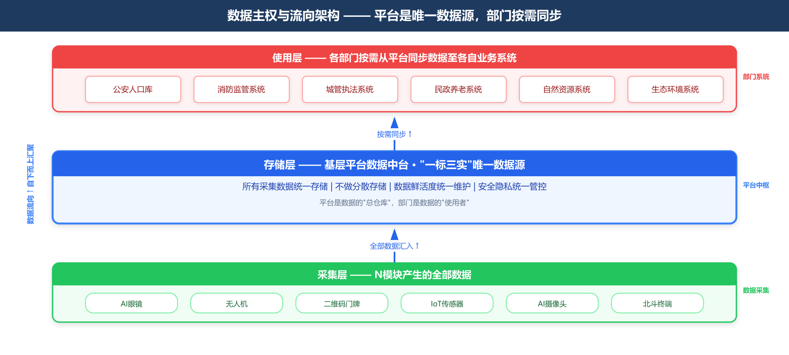

# 《基层智治综合协同平台》产品方案书 V2.0

> **版本说明：** 本版为 V2.0 正式版，在 V1 基础上全面融入四条修改意见。完整保留 V1 原有内容，新增问题对标与预期目标、安全与合规贯穿层、事件总线引擎、N分级分类、AI Agent重构、10个上饶专属场景、"一件事"叙事、数字经济路径、竞争策略等章节。

---

## 〇、问题对标与预期目标（新增）

### 0.1 当前基层治理的核心问题对标

| # | 核心矛盾 | 具体表现 | 平台解决路径 | 可量化目标 |
| --- | --- | --- | --- | --- |
| **1** | **报表多头报送** | 同一数据需向公安/综治/住建/民政等4-6个部门分别填报，网格员月度填报占工作总量35%以上 | "一标三实"统一底座→一次采集、多方复用；AI采集Agent口述即录入 | 填报时间从35%降至10%以下 |
| **2** | **系统多但用不起来** | 各部门自建系统10+个，数据不互通、基层不愿用 | 不替代任何系统，做"赋能工具+协同枢纽"；二维码门牌统一入口、赣政通统一待办 | 基层日活使用率≥70% |
| **3** | **城乡二元结构诉求不同** | 城区要精细化管理、乡镇要底线民生 | 城区/乡镇差异化场景配置；上饶专属场景深度适配 | 城区和乡镇各建成≥3个标杆场景 |

### 0.2 预期目标

| 阶段 | 时间 | 目标 | 验收标准 |
| --- | --- | --- | --- |
| **短期见效** | 0-6个月 | 减负成效"看得见" | 网格员月度文书工作减少≥10小时/人；采集Agent采纳率≥85% |
| **中期成势** | 6-12个月 | 全市覆盖+场景深化 | 12区县全覆盖；5个Agent上线；上饶专属场景第一批3个见效+第二批4个启动 |
| **长期成型** | 12-24个月 | 数据资产化+模式输出 | 形成"上饶模式"；首单数据交易完成；申报省级示范项目 |

---

## 执行摘要

| 维度 | 说明 |
| --- | --- |
| **项目名称** | 基层智治综合协同平台（"1+N+1+N" PFAS架构） |
| **为什么做** | 基层治理面临"报表多头报送、系统多但用不起来、城乡二元结构诉求不同"三大核心矛盾。已在上饶三区县落地验证，累计协同处置工单56万余件 |
| **做什么** | 以**安全与合规贯穿层**为基石，构建"1+N+1+N"四层架构——**1**基层治理平台（三大核心引擎：数据中台+GIS+事件总线）+ **N**生态平台（三级分类）+ **1**AI赋能中心（5个专题Agent=知识库+Skill，辅助决策）+ **N**治理场景（10个上饶专属场景三批落地） |
| **怎么盈利** | 基础平台授权费 + N模块独立销售 + AI Agent按需订阅 + 运维服务年费 + 数据产品孵化分成（远期） |
| **要多少钱** | 首年总投入约500-700万元（硬件约300万 + AI研发约150万 + 平台开发运维约150万）。后续年度约200-300万 |
| **核心优势** | 数据主权归平台；每个模块有归口/政策/采购路径；三区县已验证；**新壁垒：10个上饶专属场景积累 + 数据资产本地化运营** |

---

## 一、建设背景与政策依据

### 1.1 现实痛点

- **任务繁重：** 基层干部面临"上面千条线，下面一根针"，数据重复采集、多头报表。
- **条块分割：** 公安、综治、住建等系统不互通，事件需要人工跨部门协调。
- **数据孤岛：** 同一地址、同一人员信息在不同系统反复录入，且无法共享。

### 1.2 政策要求

- **习近平总书记强调：** "推动社会治理重心向基层下移，运用前沿技术推动城市管理创新。"
- **中央《关于加强基层治理体系和能力现代化建设的意见》** 要求"构建网格化管理、精细化服务、信息化支撑的基层治理平台"。
- **国务院《"高效办成一件事"指导意见》**（2024年）明确"一件事一次办"向基层治理延伸。
- **"十五五"规划** 明确提出"民生诉求统一治理、线上线下协同"。
- **省委省政府、市委市政府** 部署"为基层减负增效"。

### 1.3 平台定位

本平台不替代任何现有部门业务系统，而是做"赋能工具"和"协同枢纽"，通过数据流动与智能协同，为基层干部减负松绑。

### 1.4 为什么是"现在"（新增）

- **国家政策窗口期：** 国务院"高效办成一件事"向基层延伸；市域社会治理现代化试点进入验收阶段。
- **省级竞争格局：** 省级平台在规划统建——**窗口期约12-18个月，先占位者获先发优势**。
- **上饶差异化机会：** 婺源文旅、红色资源（方志敏故乡）、信江流域——三大独特治理场景是省级通用平台无法深度覆盖的"专属壁垒"。

---

## 二、总体架构


> **架构的第一性原理：**
> 1. 基层治理的本质是**事件驱动**（发现→上报→分拨→处置→反馈→评价）。
> 2. **安全与合规贯穿层**是政务项目的生命线，与1+N+1+N四层架构**同等重要**。

### 2.0 安全与合规贯穿层（横向基础——与四层同等重要）

> **定位：** 安全与合规不是"第五层"，也不是某一层的附属。它是**贯穿全部四层的横向基础能力**，在架构设计和方案阐述中，与1+N+1+N四层享有同等权重。

#### 分层安全职责

| 层级 | 安全职责 | 核心要求 |
| --- | --- | --- |
| **Platform** | **数据安全主责** | 政务云不出域；SM4国密存储加密+TLS 1.3传输加密；数据分级分类；访问权限最小化；操作全审计；敏感字段动态掩码 |
| **Ecology** | **接入/设备安全主责** | 终端设备认证；通信加密；供应商安全评估（≥2家互备）；固件安全更新 |
| **AI** | **Agent合规主责** | 建议可溯源；输出内容安全过滤；闭眼兜底（准确率<85%→仅建议、<70%→自动暂停）；决策在业务员 |
| **Scenarios** | **场景合规主责** | AI行为识别不采集个体身份；校园/养老场景特殊群体保护；场景上线前合规评审 |

#### 全平台共性安全基线

| 维度 | 要求 |
| --- | --- |
| **信创适配** | 服务端：鲲鹏/飞腾+麒麟/统信+达梦/人大金仓；客户端：鸿蒙OS；终端：优先国产化 |
| **等保密评** | 等保三级；密评（SM2/SM3/SM4全环节应用）；24个月复评 |
| **法规遵从** | 《数据安全法》《个人信息保护法》《无人机飞行管理暂行条例》《突发事件应对法》 |
| **安全运维** | 定期渗透测试+漏洞扫描；重大安全事件2小时内应急响应 |

### 2.1 四层架构总览

| 层级 | 定位 | 构成 | V2核心变化 |
| --- | --- | --- | --- |
| **Platform** | 统一底座 | 三大核心引擎（数据中台+GIS+**事件总线**）+ 两大协同能力（周边+格友圈） | **事件总线从散落各处强化为独立核心引擎** |
| **Ecology** | 能力插件 | 三级分类：深度绑定 + 按需调用 + 预留扩展 | **从平铺重构为分级分类** |
| **AI** | 智慧大脑 | 5个专题Agent=专题知识库+场景Skill+合规控制 | **Agent具象化**；强化辅助决策；新增合规控制 |
| **Scenarios** | 业务呈现 | 通用场景（"一件事"叙事）+ **10个上饶专属场景（三批落地）** | **新增10个上饶专属场景**；"一件事"叙事 |
| **横向贯穿** | 安全基石 | **安全与合规贯穿层**——与四层同等重要 | **从风险章节提升至架构第一性原理** |

---

## 三、第一个"1"：基础平台（Platform）—— 统一底座

### 3.1 定位

基础平台是整个体系的**统一底座**，由公司自主研发。底座之上运行三大核心引擎和两大协同能力：

```
┌─────────────────────────────────────────────┐
│              Platform 统一底座                │
├─────────────────┬─────────────────┬─────────┤
│  ① 数据中台      │  ② GIS时空底座   │ ③ 事件总线 │
│  (一标三实模型)   │  (天地图/高德)    │ (核心引擎) │
├─────────────────┴─────────────────┴─────────┤
│  ④ 周边（地址关联智能推送）                    │
│  ⑤ 格友圈/协同圈（跨部门协同+居民互动）         │
└─────────────────────────────────────────────┘
```

### 3.2 三大核心引擎

#### 3.2.1 数据中台与治理数据湖

以标准地址（一标，GB/T 35639-2017）为锚点，串联实有人口、实有房屋、实有单位（三实），形成"人—房—事—物—组织"五大要素标准化数据模型。

| 能力 | 说明 |
| --- | --- |
| 多源数据汇聚 | 汇聚公安、综治、住建、城管、民政等多部门数据，形成辖区全域"块数据" |
| 数据治理与清洗 | 地址标准化（GB/T 35639-2017）、身份证号校验、重复数据合并、失效数据标记 |
| 数据鲜活度维护 | AI眼镜采集、网格员走访、群众申报、无人机比对等多渠道持续更新，底数准确率99%+ |
| 数据资产沉淀 | 自然累积"运行数据"和"块数据"，为远期数据产品化奠基 |

**解决了什么问题：** 同一栋楼在不同系统里地址写法都不一样，同一户人口要在三个系统重复录入。现在以国标地址编码为唯一锚点，**一次采集、多方复用**，从源头终结数据孤岛。

#### 3.2.2 时空地理信息GIS底座

| 能力 | 说明 |
| --- | --- |
| 统一地图服务 | 二维/三维渲染、卫星影像、POI搜索、路径导航（政务内网天地图+便民侧高德/百度） |
| 一张图作战 | 人口热力、事件分布、风险四色图、无人机轨迹、AI眼镜实时位置——多图层叠加 |
| 空间分析 | 缓冲区分析、空间聚合、轨迹回放；无人机航线管理；三维数字底座；电子围栏 |

#### 3.2.3 事件总线引擎（核心引擎——V2重点强化）

> **基层治理的本质是事件驱动。** 事件总线是Platform三大核心引擎之一，与数据中台、GIS底座并列。它定义了"一件事在平台上如何从头跑到尾"。

##### 事件流转六步闭环

```
发现 → 上报 → 分拨 → 处置 → 反馈 → 评价
  │      │      │      │      │      │
  │      │      │      │      │      └── 群众/上级评价 + 效能自动评分
  │      │      │      │      └──────── 处置结果回传 + 群众回访
  │      │      │      └────────────── 多部门协同处置 + 全程留痕
  │      │      └──────────────────── 规则引擎 + AI分拨Agent辅助 → 人工确认
  │      └────────────────────────── 智能去重 + 语音/图片→结构化工单
  └──────────────────────────────── 多源感知统一接入（AI眼镜/IoT/无人机/扫码/北斗）
```

| 环节 | 核心能力 | 关键约束 |
| --- | --- | --- |
| **①发现** | 人工+自动双源感知→统一接入事件总线 | 人脸/车牌自动模糊 |
| **②上报** | AI去重+语音/图片→结构化工单+地址自动关联 | 敏感字段动态掩码 |
| **③分拨** | 日常→政法委规则；应急→应急管理局预案；分拨Agent辅助 | **人工确认后执行** |
| **④处置** | 多部门同页协同+融合通讯会商 | 全程留痕不可篡改 |
| **⑤反馈** | 处置结果回传+群众满意度回访 | 未达标自动退回 |
| **⑥评价** | 自动效能评分+高频事件标记"需制度性解决" | 评分规则政法委统一配置 |

##### 三条设计原则

| 原则 | 说明 |
| --- | --- |
| **分权而非集权** | 调度指令来自法定授权主体，事件总线是"流转管道" |
| **全程可追溯** | 事件完整时间轴+操作人+流转耗时——全部记录不可篡改 |
| **弹性扩容** | 峰值承载≥日常5倍（防汛/山火等应急期间） |

### 3.3 两大协同能力

#### 3.3.1 周边（地址关联信息智能推送）

| 能力 | 说明 |
| --- | --- |
| 以地址为锚点的智能推送 | 扫码门牌后，自动关联并推送该地址周边的历史隐患、重点人员、独居老人、出租房状态 |
| 角色差异化呈现 | 民警扫酒店→历史消防隐患和警情记录；网格员走访→独居老人/重点关注标记；城管扫码→占道经营历史 |
| 落地效果 | 巡查针对性提升60%，现场信息查询从平均5分钟降至"扫码即得" |

#### 3.3.2 格友圈/协同圈（跨部门协同与居民互动）

| 能力 | 说明 |
| --- | --- |
| 格友圈（工作人员端） | 网格员发现问题→一键共享至格友圈→城管/市政/市监等在同一事件页内协同处置 |
| 邻里圈（居民端） | 居民扫码进入本小区邻里圈——邻里互助、二手交易、物业报修 |
| 落地效果 | 跨部门协同周期从3.5天缩短至1.2天（缩短66%），居民"零跑腿"事项达12项 |

### 3.4 落地效果

已在广丰区、经开区、信州区落地运行：采集效率提升80%、派单准确率95%+、底数准确率99%+、重复劳动减少70%+。

---

## 四、第一个"N"：生态平台（Ecology）—— 能力模块集合

> **说明：** 第一个N是"能力插件层"——11个可插拔、可扩展的模块，每个模块既可融入平台协同使用，也可作为独立产品单独销售。

### 4.0 分级分类体系（V2新增）以及与第一个1的关系

| 分类 | 整合策略 | 替换成本 | 数据流向 | 包含模块 |
| --- | --- | --- | --- | --- |
| **🟢 深度绑定** | 定制化对接、身份互信、双向数据同步、联合运维SLA | 高 | 双向实时同步 | 赣政通、E呼即办、雪亮工程/AI摄像头、二维码门牌 |
| **🔵 按需调用** | 标准化API接入，品牌无关化，供应商≥2家互备 | 低 | 单向采集至平台 | AI眼镜、无人机、IoT传感器网络、北斗终端、融合通讯终端、智慧调度系统、效能评估系统 |
| **🟡 预留扩展** | 接口规范预定义，条件成熟后引入 | 可控 | 按接入规范定义 | 电子地图（多源切换）、AI算法市场、区块链存证、碳普惠/绿色治理 |


### 4.1 核心特征与数据主权

**一句话定义：** 第一个"N"是一组可插拔、可扩展的能力模块集合。

| 特征 | 说明 |
| --- | --- |
| **即插即用** | 每个模块通过标准化API与基础平台对接，不依赖特定品牌或供应商 |
| **可独立交付** | 任一模块可拆分出来单独销售和部署 |
| **可融合协同** | 模块间天然具备协同关系——无人机发现问题→AI眼镜地面核查→事件中心闭环处置 |
| **持续扩展** | N不是固定数字，随业务发展持续增加 |

**核心理念：** 联接而非替代。市场上已有的优秀硬件和政务系统，不做重复建设，通过标准化接口实现"即插即用"。
**数据主权原则：** 所有模块采集的数据统一汇聚至Platform数据中台——平台是唯一数据源，各部门按需从平台同步。



### 4.2 智能硬件类 —— AI眼镜

（4.2.1 以 AI眼镜 为代表详述，其余 6 个硬件模块完整描述见 4.3 节——每个模块均含摘要、功能描述、主管部门、核心能力、三个场景。）

AI眼镜是专为基层一线工作人员打造的**解放双手的智能巡查终端**——摄像头、骨传导耳机、显示模块全部集成在眼镜上。戴上眼镜即可实现语音交互、AI视觉识别、远程协作三大核心能力。

**核心能力：** 语音上报（口述→自动转写工单）、AI视觉识别（可疑人员/车辆/隐患）、OCR证件识别（扫一眼自动提取）、AR导航引导（HUD投射检查清单防漏项）、远程标注/直播（第一视角回传指挥中心）、免提扫码（看向门牌自动识别）、离线工作（端侧AI，回网自动同步）。

**主管部门：** 网格员→政法委（综治中心）管理；民警→公安局管理；消防检查人员→消防救援支队管理；城管→城市管理局管理。政策依据：中央政法委市域社会治理现代化试点要求。

**三个最常用场景：**
- **入户信息采集**：AI眼镜看向门牌自动识别地址→口头询问自动转写记录→OCR扫身份证填入表单。15分钟→3分钟，效率提升80%。
- **安全巡检**：HUD逐项显示检查清单→AI自动识别灭火器有效期/通道堵塞→自动生成整改通知书。40分钟→15分钟，漏项率从15%→<2%。
- **纠纷现场联合处置**：AI眼镜直播→后方专家远程标注指导→GIS比对历史测绘数据→当场给出调解方案。10分钟完成勘查。

### 4.3 其余智能硬件模块

#### 4.3.1 无人机自动巡飞系统

> **摘要：** 7×24小时无人值守自动机库，AI识别16+类场景，"综合飞一次"多部门数据共享，巡查覆盖效率提升20倍，飞行成本降低67%。

**功能描述：** 无人机自动巡飞系统是**空中自动化的城市感知网络**。以自动机库为物理节点，实现7×24小时无人值守。系统按预设航线自动起飞、巡航、AI智能识别异常、自动生成工单，与地面网格员和AI眼镜形成"天上看、地上查、云上算"的立体治理闭环。

**主管部门与合规要求：**

| 维度 | 说明 |
| --- | --- |
| **空域审批** | 飞行活动须通过民航局UTMISS系统实名登记和飞行计划报备。禁飞区硬限制不可飞入。应急灾情可事后补报 |
| **AI识别场景与归口** | ①违建/工地裸土→城管局 ②垃圾/占道→城管局 ③火点/烟雾→应急管理局 ④河道异常→水利局 ⑤市政设施破损→城管局 ⑥农林变化→自然资源局/农业农村局 |
| **数据共享机制** | 由政法委（综治中心）统一协调，实行"综合飞一次"模式——一次飞行产出多部门可用的巡检数据 |
| **政策依据** | 国务院《无人驾驶航空器飞行管理暂行条例》（2024年施行）；住建部城市运行管理服务平台建设指南 |

**核心能力清单：**

| 能力 | 说明 |
| --- | --- |
| 自动机库 | 7×24小时无人值守，自动起降、自动充电，防雨防尘（IP55+） |
| 航线规划 | GIS地图上可视化绘制航线，禁飞区自动避让 |
| AI智能识别 | 实时识别16+类场景，识别结果按归口部门自动分类推送 |
| 闭环工单联动 | AI发现问题→自动生成工单→按问题类型匹配归口部门→推送对应网格员 |
| 复查验证 | 处置后自动复飞比对，确认问题已解决 |
| 实时图传 | 1080P低延迟视频流接入指挥大屏和融合通讯系统 |
| 远程喊话 | 搭载喊话器，用于防溺水驱离、大型活动引导、应急疏散等 |

**三个最常用场景：**

- **违建常态巡查**：每天上午9点无人机自动起飞巡飞辖区20平方公里，AI同时识别违建/垃圾/河道漂浮物/工地裸土，"综合飞一次"后飞行成本降低67%，巡查覆盖效率提升20倍
- **大型活动安保**：龙舟赛期间3架无人机同时升空，高空俯瞰人流密度、沿河巡航、空中喊话引导，AI识别到人群密度超阈值→融合通讯调度安保疏导，响应速度从分钟级缩短至秒级
- **灾后快速评估**：特大暴雨后无人机立即起飞，30分钟完成全镇50平方公里灾情扫描，AI自动识别积水/道路中断/房屋受损/滑坡风险，灾情评估时间从半天缩短至30分钟

#### 4.3.2 二维码门牌

> **摘要：** 基于国标GB/T 35639-2017统一编码，角色化扫码入口（群众/网格员/民警/管理者不同视图），"一码共治"实现多部门扫同一个码各取所需，单次操作平均节省3次页面跳转。

**功能描述：** 二维码门牌是**基层智治平台的统一物理入口**。为每栋房屋、每个单位赋予唯一的"数字身份证"，基于国标统一编码。扫码即进入本平台，根据扫码者身份和权限，自动呈现对应的功能视图和数据范围。

**主管部门：** 上饶市大数据局已牵头完成全市二维码门牌的统一编码和现场贴牌工作；公安局负责标准地址（GB/T 35639-2017）的编制和变更审核；住建局、民政局、市场监管局、自然资源局提供数据协作。

**核心能力清单：**

| 能力 | 说明 |
| --- | --- |
| 统一地址编码 | 基于国标建立全市统一地址编码体系，每个门牌拥有唯一地址ID，串联"人—房—事—物—组织"五要素 |
| 角色化扫码入口 | 同一门牌，不同角色扫码进入不同功能视图——群众→便民服务页，网格员→工作采集页，民警→警务工作页 |
| 一站式功能聚合 | 扫码触达智慧物业、公众服务、信息采集、安全检查、社区警务、综治网格、圈子互动等7大类40+项功能 |
| 一码共治 | 多部门扫同一个码各取所需——公安查人口、消防查隐患、城管查违建、市场监管查执照、物业发公告 |

**三个最常用场景：**

- **网格员"一码通办"**：扫码→平台根据角色呈现待办任务+常用功能入口+辖区风险提示，3分钟完成走访记录，单次操作节省3次页面跳转
- **出租屋"以房管人"**：民警扫码→呈现该栋楼住了29人（流动人口22人）、历史警情、消防检查记录、房东联系方式，核查效率提升70%
- **多部门"一码共治"**：同一商铺门牌二维码→网格员/消防检查员/城管/市场监管/店主五种角色五种视图五套权限，数据各自归口维护，平台汇聚共享

#### 4.3.3 融合通讯终端

> **摘要：** 视频会议终端+公网对讲+执法记录仪+5G单兵，跨设备跨网络统一指挥调度。应急响应启动从15分钟缩短至2分钟。

**功能描述：** 融合通讯终端是**跨设备、跨网络的统一指挥调度硬件体系**。通过SIP/H.323标准协议统一接入基础平台的融合通讯调度引擎，实现指挥中心与现场人员的"看得见、叫得应、调得动"。

**归口划分：** 公安条线有其专用PDT警用数字集群通讯专网，本平台不与PDT专网直接互通，而是在指挥大屏侧实现"同屏展示"；网格员/城管/应急等通用条线使用本平台融合通讯调度引擎。应急状态下接受应急管理局（《突发事件应对法》法定应急指挥权）统一指挥调度。

**核心能力：** 视频会议终端（多方可视通话，多部门独立频道）、公网对讲机（一键对讲/群组呼叫/紧急广播）、执法记录仪（全程录音录像云端存储）、5G单兵设备（5G高清图传内置GPS）、全程留痕（录音录像按归口部门分别管理）。

**三个最常用场景：**

- **应急指挥"一键拉会"**：突发山火→GIS圈选火场周边→系统列出12名网格员+3名护林员+2台无人机→一键发起融合通讯群呼→12人同时在线，应急响应启动从15分钟缩短至2分钟
- **日常巡查"公网对讲"**：网格员发现可疑人员→按对讲键呼叫综治中心→通知辖区派出所→公安PDT专网收到指令→3分钟到场处理
- **跨部门"联合视频会商"**：化工厂泄漏→应急/环保/消防/卫健四部门视频会商→5G单兵回传第一视角→四方会商10分钟形成方案

#### 4.3.4 物联网传感器网络

> **摘要：** 按归口部门分别部署（消防烟感/水利水位/城管井盖/自然资源地灾/生态环境扬尘），平台提供统一NB-IoT/Cat.1接入+告警→工单转换+GIS展示，火灾发现从"起火后"提前到"冒烟时"。

**功能描述：** 物联网传感器网络是**城市运行状态的"神经末梢"**，通过在城市关键节点部署各类智能传感器，实现对环境、安全、设施的24小时自动感知和异常预警。**关键设计原则：** 传感器设备由各归口部门按职责分别采购、分别部署、分别维护，平台提供统一数据接入标准和告警→工单→分拨的共性能力。

**按归口部门分列：**

| 归口部门 | 设备类型 | 部署位置 | 告警流转 |
| --- | --- | --- | --- |
| 消防救援支队 | 智能烟感、电气火灾监测 | 老旧小区、出租屋、电动车充电棚 | 平台事件中心→生成消防类工单→推送消防支队+属地街道+网格员 |
| 水利局 | 水位监测仪 | 易涝点、河道闸站、水库 | 水位异常→推送水利局+应急管理局+属地街道 |
| 城管局 | 窨井盖传感器 | 主干道、学校周边、商业区 | 井盖异常→自动识别权属单位→推送对应抢修班组 |
| 自然资源局 | 地灾监测（边坡位移/土壤含水率/裂缝） | 地质灾害隐患点 | 预警阈值→融合通讯外呼乡镇负责人+推送自然资源局+应急管理局 |
| 生态环境局 | 扬尘噪音监测（PM2.5/PM10/噪音） | 工地、主干道、工业区 | 超标→生成环保类工单→推送生态环境局+住建局 |

**三个最常用场景：**

- **老旧小区火灾综合防控**：凌晨2点烟感+电气监测同时告警→平台自动匹配地址+住户信息→融合通讯自动拨打房东+网格员+微型消防站。火灾发现从"起火后"提前到"冒烟时"
- **城市内涝"水利+城管"联合防控**：暴雨红色预警→水利水位+城管积水实时回传→平台综合判定"隧道内涝风险"→同时推送城管抢修+交警+水利局。打破三部门信息壁垒
- **窨井盖"权属自动识别"**：小学门口井盖倾斜→平台自动读取权属标签→自动生成工单推送自来水公司抢修班组+城管局监督。解决推诿扯皮问题

#### 4.3.5 AI智能监控摄像头网络

> **摘要：** 依托雪亮工程复用现有摄像头，叠加AI行为识别（不采集个体身份），与无人机形成"固定哨+巡逻兵"立体感知体系，走失人员找回时间从平均4小时缩短至30分钟。

**功能描述：** AI智能监控摄像头网络是**城市固定点位的"不眨眼的哨兵"**。依托政法委"雪亮工程"已建成的摄像头基础设施，叠加AI视觉分析能力，在不新建硬件的前提下，让现有摄像头从"被动录像"升级为"主动发现"。

**与无人机的互补：** 无人机是"巡逻兵"（移动巡飞，周期覆盖，小时级发现），AI摄像头是"固定哨"（固定点位，7×24小时持续，秒级发现）。协同关系：摄像头发现异常→触发无人机起飞侦察；无人机发现目标→联动最近摄像头持续跟踪。

**核心能力：** AI实时识别（人群异常聚集/烟火检测/重点部位入侵/老人儿童异常徘徊）、事件自动生成（截图+时间戳+坐标→流入事件中心）、多摄像头联动（走失人员跨区域接力查找）、隐私合规（人脸/车牌自动模糊处理，AI仅做行为识别不做个体身份持续追踪）。

**三个最常用场景：**

- **走失人员快速查找**：网格员录入体貌特征→AI筛选周边摄像头画面匹配轨迹→触发无人机起飞→推送周边网格员。38分钟找到走失老人（传统方式平均4小时）
- **大型活动人流安全引导**：元宵灯会AI摄像头实时统计人流密度→热力图叠加GIS→超阈值触发LED大屏引导+赣服通推送+融合通讯调度安保
- **校园周边安全守护**：AI检测到男子在校门口长时间停留→判定"异常徘徊"→自动生成预警工单推送护学岗民警→3分钟到场盘查。全程AI只做行为识别

#### 4.3.6 北斗定位关爱终端

> **摘要：** 面向独居老人/失智老人的智能胸卡/手环，24小时无活动→自动生成"上门查看"关爱任务，预警到送医42分钟，走失找回从4小时缩短至15分钟。

**功能描述：** 北斗定位关爱终端是**面向民政养老服务体系的特殊群体安全守护设备**。以智能胸卡/手环形态，为独居老人、失智老人等政府重点关爱群体提供实时定位、电子围栏、SOS求助、异常预警四大核心能力。终端告警与平台事件中心+网格体系联动，形成"智能发现→自动派单→网格员上门→闭环反馈"的完整关爱链条。

**主管部门与采购：** 民政局养老服务科主管，民政养老服务专项资金/政府购买养老服务项目出资，独居老人/失智老人/高龄空巢老人等纳入民政关爱名单的特殊困难群体政府免费发放。轨迹数据加密存储，仅授权家属+责任网格员可见。

**核心能力：** 北斗/GPS实时定位（室内外精度<5米，加密存储）、电子围栏（家属设定，越界秒级通知家属+网格员）、SOS一键求助（长按3秒触发，自动拨打通话+推送位置）、长时间静止预警（24小时无活动→自动生成"上门查看"关爱任务）、低功耗长续航（待机7-10天，NB-IoT/Cat.1，IP67防水）。

**三个最常用场景：**

- **独居老人"寂静预警"**：老人26小时无外出轨迹→自动生成关爱任务→网格员15分钟到达→敲门无人应答→联系儿子→发现老人因高血压头晕卧床及时送医。预警到送医42分钟
- **失智老人"安心围栏"**：老人走出电子围栏→秒级触发三方通知（家属APP+网格员+30分钟后未确认通知派出所）→女儿5分钟追上带回。走失找回从4小时缩短至15分钟
- **社区矫正人员轨迹监管（扩展）**：司法局授权下设定监管规则→北斗终端轨迹自动比对→越界告警推送司法所管理人员。平台仅做数据采集和规则比对（与养老场景数据/权限完全隔离）

### 4.4 本地政务软件类

#### 4.4.1 赣政通（任务推送与协同办公）

> **摘要：** 江西省统一政务协同办公平台，覆盖省—市—县—乡四级、联通超万个政务部门。本平台与赣政通身份互信+待办同步+任务推送+督查联动，实现基层人员一个入口处理所有待办。截至2026年3月协同处置工单56万余件。

**功能描述：** 赣政通是江西省统一政务协同办公平台。本平台与赣政通深度对接，实现身份互信、待办同步、任务推送、督查联动四大核心能力，让基层人员在赣政通一个入口处理所有待办。

**核心对接能力：**

| 对接项 | 说明 |
| --- | --- |
| 身份互信 | 通过省统一身份认证平台实现互信登录，一个账号通两平台 |
| 待办同步 | 本平台任务自动推送至赣政通待办中心，签收/完成状态双向同步 |
| 消息通知 | 本平台预警、提醒通过赣政通消息通道推送 |
| 督查对接 | 超时未处置事件可同步至赣政通督查督办模块，触发逐级催办 |

**三个最常用场景：**

- **巡查任务"自动推、自动收"**：网格员打开赣政通→待办中心列出今天3项任务（消防检查+走访老人+核实违建线索）→逐一点击签收→每完成一项提交结果→待办自动消除。任务指派从"微信群@人"升级为"系统自动推送+跟踪"
- **超时事件"逐级催办"**：工单超处置时限4小时未签收→三级催办：①推送网格员→②1小时后推送主管→③再1小时后推送街道分管领导。同时同步至赣政通督查督办模块。工单及时签收率98%+，超时率下降80%
- **跨部门"公文+事件"联动**：河道漂浮物事件处置结案→系统提示"该河段3个月4次同类事件"→水利局经办人在赣政通起草《河道保洁通知》→利用赣政通公文流转下发至沿线3个乡镇。打通"事件处置→问题研判→制度修订"闭环

#### 4.4.2 E呼即办（民生诉求联动）

> **摘要：** 上饶市创新"12530"机制（1分钟成单→2分钟派单→5分钟签收→30分钟到场），整合110/12345/社会治理网格三张网，18家高频部门常驻联合指挥中心。本平台与E呼即办形成"前台指挥+后台支撑"双平台联动，平均办结时长从44小时压缩至12小时（缩短73%）。截至2026年3月累计协同处置工单56万余件。

**功能描述：** E呼即办是上饶市创新建设的民生诉求快速响应平台。以"12530"机制实现极速响应。本平台作为后台数据底座和协同处置工具，与E呼即办形成"前台指挥+后台支撑"的双平台联动。

**核心对接能力：**

| 对接项 | 说明 |
| --- | --- |
| 工单双向同步 | E呼即办工单同步至本平台；网格员上报事件推送至E呼即办 |
| 标准地址匹配 | E呼即办工单通过本平台"一标三实"底座自动解析地址 |
| 处置过程互通 | 网格员处置记录实时回传E呼即办 |
| 融合通讯联动 | E呼即办调取本平台无人机图传/AI眼镜直播流 |
| 吹哨对接 | 网格员一键发起E呼即办"吹哨报到"流程 |

**三个最常用场景：**

- **"12530"极速响应**：市民拨打12345→1分钟成单→"一标三实"地址库自动解析→2分钟内派单至自来水公司+交警→5分钟签收→25分钟到场。全程33分钟（传统平均44小时）
- **"吹哨报到"跨部门联动**：网格员发现地下室违规住人+私拉电线+煤气罐（分属住建/消防/应急）→一键吹哨→E呼即办指挥中心审核→三个部门同时收到报到指令→联合到场处置。已累计处理吹哨事件92件，延伸解决问题370余个，满意率96.5%
- **"未呼先办"主动治理**：联合分析近半年诉求数据→AI发现每年6-8月空调外机噪音投诉激增→5月底提前部署：物业下发自查通知+网格员入户提醒+维修资源储备。6月同类投诉同比下降65%

#### 4.4.3 智慧调度指挥系统

> **摘要：** 基于GIS和AI的事件智能分拨与资源优化调度平台。通过"事件自动分类→地址精准匹配→规则引擎分拨→资源最优配置"四级调度链，派单准确率从60%提升至95%。分权设计：政法委→日常调度、应急管理局→应急指挥、E呼即办→民生联动。

**功能描述：** 智慧调度指挥系统是**基于GIS和AI的事件智能分拨与资源优化调度平台**。实现从"人工判断派给谁"到"系统辅助算出最优解"的升级。

**调度授权来源（关键设计）：** 跨部门调度不是技术问题，是组织授权问题。系统设计遵循分权而非集权原则：

| 调度场景 | 授权主体 | 授权依据 |
| --- | --- | --- |
| 网格员日常调度 | 政法委（综治中心） | 中央文件明确综治中心承担"指挥调度"职能 |
| 应急指挥调度 | 应急管理局 | 《突发事件应对法》授予法定应急指挥权 |
| 民生诉求联动调度 | E呼即办联合指挥中心 | 上饶市18家部门常驻联合指挥机制 |
| 部门内部调度 | 各归口部门自行管理 | 对本部门人员有天然管理权 |

**核心能力：** 事件智能分类（NLU自动识别事件类型/紧急程度）、地址精准匹配（基于"一标三实"自动解析）、规则引擎分拨（日常模式政法委规则+应急模式应急管理局规则）、资源最优配置（综合距离/技能/忙闲状态推荐最佳处置人员）。

**三个最常用场景：**

- **日常事件"智能分拨"**：市民投诉"XX路烧烤店油烟扰民"→NLU识别为餐饮油烟（城管主责+环保协办）→地址匹配至"城南街道第3网格"→推荐城管老王为主办人。派单准确率从60%→95%
- **应急资源"一张图调度"**：山林火灾→应急管理局确认"进入应急模式"→GIS以火点为中心展示同心圆资源分布→系统推荐最优方案→一键下发网格员+护林员+消防车+无人机。从"凭印象喊人"升级为"系统算出最优解"
- **网格员"负荷均衡"**：第2网格小张5个待办（饱和），相邻第3网格小李仅1个→新增任务自动改派给小李。负荷均衡化，任务完成时效提升25%

#### 4.4.4 基层治理效能评估系统

> **摘要：** "数字体检师"定位，五维效能画像（任务完成率/巡查覆盖率/事件处置时效/群众满意度/数据鲜活度），核心原则：不公开个人排名、核心指标是"减负成效"。从"被考核的压力"变为"被帮助的感觉"。

**功能描述：** 基层治理效能评估系统是**基层工作的"数字体检师"**，帮助网格员发现自己工作的短板、帮助街道找到管理中的薄弱环节、帮助部门看清改进的方向。核心定位：**"帮助基层发现问题、改进工作"**，而非"给基层增加一个考核工具"。

**与传统考核的本质区别：**

| 维度 | 传统考核 | 本系统 |
| --- | --- | --- |
| 数据来源 | 基层填表上报，可能"美化" | 系统直接从平台取数，不可篡改 |
| 核心目的 | 排名→奖惩 | 诊断→改进 |
| 更新频率 | 每月/每季度一次 | 实时计算，随时可查 |
| 个人排名 | 公开个人排名 | 仅个人纵向对比（"和自己比进步"），不公开个人排名 |
| 组织排名 | 凭印象 | 红黑榜仅限街道/部门级（在部门负责人范围内可见） |

**核心原则：** ①不公开个人排名——网格员只能看到自己的效能数据和历史对比 ②部门排名仅限内部——红黑榜在部门负责人范围内可见 ③核心指标是"减负成效"——最重要的指标是"系统帮你省了多少填表时间"

**核心能力：** 五维效能画像（任务完成率/巡查覆盖率/事件处置时效/群众满意度/数据鲜活度）、个人纵向对比（本月vs上月、本季度vs上季度）、智能诊断报告（AI根据薄弱指标自动生成改进建议，每条附具体操作入口）、数据下钻溯源（每个分数可下钻至原始工单）、基层减负成效可视化（统计"系统帮你省了多少填表时间"）。

**三个最常用场景：**

- **网格员"自我体检"**：打开个人"效能体检"→看到五维雷达图→系统提示"相比上月处置时效提升6分，进步明显！"→同时给出3条可操作改进建议→看不到其他网格员的分数。从"被考核"变为"被帮助"
- **街道"红黑榜"（内部管理参考）**：每月5日更新→点击末位街道→自动标注拖分项+下钻原始数据+根因分析（3个网格旧城改造密集、人均管理商户数是其他街道1.5倍）→自动建议增配网格员+优先部署智能烟感+精简检查清单
- **基层减负成效"看得见"**：网格员每月收到赣政通消息"本月平台为您自动生成巡查日志38份（省6h）+走访记录15份（省3h）+AI填写简报22份（省4h）= 省13h"。全区累计节省文书工作时间8,200小时/月

### 4.5 模块间协同关系总览

#### 协同矩阵

|  | AI眼镜 | 无人机 | 二维码门牌 | IoT传感器 | AI摄像头 | 北斗终端 | 赣政通 | E呼即办 | 智慧调度 | 效能评估 |
| --- | --- | --- | --- | --- | --- | --- | --- | --- | --- | --- |
| **AI眼镜** | — | ✅✅✅ | ✅✅ | ✅ | ✅✅ | ✅ | ✅ | ✅✅ | ✅ |
| **无人机** | ✅✅✅ | — | — | — | ✅✅✅ | — | ✅ | ✅✅ | ✅✅ |
| **二维码门牌** | ✅✅ | — | — | ✅ | ✅ | ✅✅✅ | ✅ | ✅ | ✅ |
| **IoT传感器** | ✅ | — | ✅ | — | ✅ | ✅✅ | ✅ | ✅ | ✅✅ |
| **AI摄像头** | ✅✅ | ✅✅✅ | ✅ | ✅ | — | — | ✅ | ✅ | ✅✅ |
| **北斗终端** | ✅ | — | ✅✅✅ | ✅✅ | — | — | ✅ | ✅ | ✅ |
| **赣政通** | ✅ | ✅ | ✅ | ✅ | ✅ | ✅ | — | ✅ | ✅✅ | ✅ |
| **E呼即办** | ✅✅ | ✅✅ | ✅ | ✅ | ✅ | ✅ | ✅ | — | ✅✅✅ |
| **智慧调度** | ✅ | ✅✅ | ✅ | ✅✅ | ✅✅ | ✅ | ✅✅ | ✅✅✅ | — | ✅ |
| **效能评估** | — | — | — | — | — | — | ✅ | — | ✅ |

> ✅✅✅ = 杀手级协同  ✅✅ = 强协同  ✅ = 协同  — = 弱协同或无协同

#### 三大核心协同链

**"空地一体"立体巡防链：**
```
无人机自动巡飞（空中AI识别违建）
  → 工单自动流入事件中心
  → 智慧调度系统匹配责任网格员
  → 推送至网格员赣政通待办
  → 网格员佩戴AI眼镜到场核查
  → 处置结果回传E呼即办
  → 无人机自动复飞验证
```

**"一码共治"协同链：**
```
二维码门牌（统一入口，角色化视图）
  → 群众扫码→本平台便民服务页（投诉/报修/办证）
  → 网格员扫码→本平台工作采集页（信息采集/任务执行）
  → 民警扫码→本平台社区警务页（人口核查/安全检查）
  → 管理者扫码→本平台数据看板（辖区概况/风险预警）
  → 外部渠道（赣服通等）→群众诉求通过门牌地址绑定→数据同步至本平台事件中心→统一分拨处置
  → 全量数据沉淀→效能评估系统（趋势分析+风险预警）
```

**"未呼先办"预判链：**
```
效能评估系统（发现高频共性问题+趋势预判）
  → 智慧调度系统（生成预防性任务）
  → 推送至赣政通（网格员执行）
  → IoT传感器（持续监测验证）
  → 效能评估系统（效果评估+减负成效统计）
```

**"空地哨"立体安防链：**
```
AI摄像头（固定哨，7×24实时监测）
  → 识别异常（人群聚集/异常徘徊/烟火）→自动生成告警工单
  → 事件中心→智慧调度匹配最近警力
  → 同时自动触发无人机起飞（空中侦察+高空视角）
  → 到场警力佩戴AI眼镜（地面第一视角+身份核查）
  → 无人机+AI眼镜双路画面回传指挥中心大屏
  → 处置完毕→AI摄像头持续监测，确认异常消除
  → 全流程数据沉淀→效能评估系统计入响应时效得分
```

#### 模块扩展机制

**接入四原则：**

| 原则 | 说明 |
| --- | --- |
| **有标准化接口** | 优先选择提供开放API的成熟产品 |
| **不与现有能力重复** | 新增模块必须带来差异化价值 |
| **品牌无关化** | 接入层统一封装，切换供应商仅需适配底层 |
| **安全合规** | 政务内网侧严格遵守数据不出域、访问全程审计 |

**当前模块清单：**

| 序号 | 模块名称 | 分类 | 状态 |
| --- | --- | --- | --- |
| 1 | AI眼镜 | 智能硬件类 | 已规划，待落地 |
| 2 | 无人机自动巡飞系统 | 智能硬件类 | 建议新增 |
| 3 | 二维码门牌 | 智能硬件类 | 已部分落地（三个区县） |
| 4 | 融合通讯终端 | 智能硬件类 | 部分落地 |
| 5 | IoT传感器网络 | 智能硬件类 | 建议新增 |
| 6 | AI智能监控摄像头网络 | 智能硬件类 | 建议新增 |
| 7 | 北斗定位关爱终端 | 智能硬件类 | 建议新增 |
| 8 | 赣政通 | 本地政务软件类 | 已对接 |
| 9 | E呼即办 | 本地政务软件类 | 已对接 |
| 10 | 智慧调度指挥系统 | 本地政务软件类 | 建议新增 |
| 11 | 基层治理效能评估系统 | 本地政务软件类 | 建议新增 |

> **第一个"N"的本质，是让基层智治平台不成为"新的孤岛"。** 它不是另起炉灶、重新发明，而是**联接**——向上联接AI智慧、向下联接数据底座、横向联接市场上已有的优秀产品和政务侧成熟的业务系统。每一个N模块，都是一块拼图。单独拿出来，它是能独立创造价值的产品；拼在一起，它们通过基层平台的底座和数据实现1+1>2的化学反应。

---

## 五、第二个"1"：AI赋能中心（AI）—— 辅助决策工作台

> **V2核心变化：** ①强化"辅助决策"——业务决策权在业务员侧；②Agent = 专题知识库 + 场景Skill；③新增Agent合规控制。

### 5.1 核心理念

> **AI只做建议、不做决定。业务决策权永远在一线业务员侧。**
> 每个Agent = **专题知识库**（结构化领域知识）+ **场景Skill**（具体AI行为），不是"通用AI"，而是"懂这个领域的数字同事"。

### 5.2 Agent的构成（V2新增）

| Agent | 专题知识库 | 场景Skill | 辅助决策方式 | 落地阶段 |
| --- | --- | --- | --- | --- |
| **采集Agent** | 地址标准库、数据字典、校验规则库 | 语音→表单、OCR识别、对话引导、静默采集 | AI填充→网格员确认→提交 | 第一阶段 |
| **巡查Agent** | 消防法规库、建筑规范库、隐患知识图谱 | 隐患视觉识别、AR引导、自动生成报告 | AI标记隐患→检查员确认→生成报告 | 第一阶段 |
| **调解Agent** | 法律条文库、相似案例库、调解策略模板 | 案例检索、法规定位、策略建议、模拟培训 | AI推荐→调解员参考→自主判断 | 第二阶段 |
| **分拨Agent** | 部门职责矩阵、历史分拨记录、负荷数据 | 事件识别、部门匹配、协同组合建议 | AI推荐方案→综治中心确认→下达 | 第二阶段 |
| **预判Agent** | 时序库、空间聚类、季节规律库 | 周期预测、热力分析、根因分析、风险热力图 | AI预测→业务部门研判→制定措施 | 第三阶段 |

### 5.3 五个专题Agent详细描述

#### Agent 1：采集Agent —— "口述即录入"

| 维度 | 说明 |
| --- | --- |
| **核心能力** | **双向对话式采集**：AI主动追问缺失字段——"身份证号是多少？""该户是否有出租？"，像老网格员带新人一样引导式采集 |
| **杀手功能** | **"静默采集"模式**：AI眼镜全程录音，AI后台自动提取关键信息填入表单，网格员无需任何手动操作，做到真正的"零录入" |
| **解决痛点** | 基层录入慢、易出错、老人不会用APP。从"填表"变"聊天"，采集门槛降为零 |
| **减负效果** | 单次采集从15分钟降至3分钟（效率提升80%），新人第一天就能独立采集 |
| **技术支撑** | ASR语音转写 + NLU语义理解 + 对话状态管理 + LLM信息提取 |
| **落地阶段** | **第一阶段**（技术成熟度最高，ASR+NLU已是成熟技术，3个月内可上线） |
| **赋能N层模块** | AI眼镜（硬件终端）、二维码门牌（地址锚定）、数据中台（数据写入） |

#### Agent 2：巡查Agent —— "AR眼睛+AI大脑"

| 维度 | 说明 |
| --- | --- |
| **核心能力** | **"会学习的检查员"**：AI实时分析眼镜画面——看到灭火器自动识别有效期、看到电线自动判断是否私拉、看到通道自动计算宽度是否达标 |
| **杀手功能** | **"隐患知识图谱"**：将消防法规、建筑规范、历史隐患案例构建为知识图谱，AI理解"什么是隐患"而不仅仅是"看到了什么"。新发现的隐患类型自动入库，越查越准 |
| **解决痛点** | "新员工不会查、老员工漏项查"，隐患识别标准不统一 |
| **减负效果** | 单次检查从40分钟降至15分钟，漏项率从15%降至2%以下，隐患发现率从60%升至85% |
| **技术支撑** | CV视觉识别 + 知识图谱推理 + AR增强现实 + 端侧AI推理（离线可用） |
| **落地阶段** | **第一阶段**（与采集Agent同步上线，复用CV+知识图谱基础设施） |
| **赋能N层模块** | AI眼镜（画面采集）、无人机（航拍图像AI识别）、IoT传感器（告警联动校验） |

#### Agent 3：调解Agent —— "随身法律顾问"

| 维度 | 说明 |
| --- | --- |
| **核心能力** | 现场调解时，AI实时推送"三件套"——①相似案例及处置结果 ②适用法规条文（精确到第几条） ③推荐调解策略 |
| **杀手功能** | **"调解模拟器"**：新人培训时，AI扮演"上访群众"，网格员练习调解技巧，AI评判表现并给出改进建议 |
| **解决痛点** | 基层人员法律知识薄弱、调解靠经验、新人不敢独立调解 |
| **减负效果** | 调解成功率提升30%，新人独立调解培训周期从3个月缩短至2周 |
| **技术支撑** | RAG检索增强生成 + 语义向量索引 + 案例推理(CBR) + 对话系统 |
| **落地阶段** | **第二阶段**（需要积累3个月以上的案例库和政策库数据） |
| **赋能N层模块** | 事件闭环处置、赣政通（案例推送）、效能评估（调解成功率统计） |

#### Agent 4：分拨Agent —— "秒级精准派单"

| 维度 | 说明 |
| --- | --- |
| **核心能力** | **"预判式分拨"**：不仅分拨当前事件，还自动关联历史同类事件——"该地址过去3个月有4次同类投诉，建议升级处置""该类型事件本周已是第8起，可能存在系统性原因" |
| **杀手功能** | **"协同建议"**：AI不是简单派给一个人，而是推荐最佳协同组合——"建议城管主办+环保协办，参考XX街道类似事件的成功处置方案" |
| **与智慧调度的分工** | 分拨Agent是"AI大脑"做决策建议（该派给谁），智慧调度系统是"执行系统"做派单和跟踪（派出去、跟回来）。两者各司其职 |
| **减负效果** | 派单准确率95%以上，人工干预减少80%，决策时间缩短60% |
| **技术支撑** | NLU意图识别 + 实体提取 + 地址匹配（一标三实） + 规则引擎 + 协同过滤推荐 |
| **落地阶段** | **第二阶段**（与调解Agent同步，需要历史工单数据训练分拨模型） |
| **赋能N层模块** | 智慧调度（执行派单）、赣政通（任务推送）、E呼即办（工单同步） |

#### Agent 5：预判Agent —— "治理天气预报"

| 维度 | 说明 |
| --- | --- |
| **核心能力** | **"治理天气预报"**：像天气预报一样预测治理风险——"下周XX街道空调噪音投诉预计上升30%，建议提前介入""下月XX区域进入汛期，历史数据显示该区域积水工单会增加50%" |
| **杀手功能** | **"风险热力预报"**：在GIS地图上展示未来7天的风险预测热力图（橙色=风险上升、红色=高风险），领导看大屏时像看天气预报一样看治理风险 |
| **解决痛点** | "问题出了才知道""治理靠经验而非数据""预防性治理手段缺失" |
| **远期价值** | 从"接诉即办"升级为"未呼先办"，最终形成可对外销售的"城市治理风险预测"数据产品 |
| **技术支撑** | 时序分析 + 空间聚类 + 因果推断 + LLM辅助解读 + GIS可视化 |
| **落地阶段** | **框架先行**——历史数据积累3个月后模型即可上线。第三阶段正式发布预测功能 |
| **赋能N层模块** | IoT传感器（监测数据输入）、无人机（预防性巡飞触发）、智慧调度（预防性任务生成）、效能评估（预判准确率统计） |

### 5.4 AI运营中心（核心差异化能力）

> AI不是部署完就完事了——**运营重于建设。**

| 能力 | 说明 |
| --- | --- |
| **人工修正→自动学习** | 每次网格员修改AI建议（如修改了AI推荐的派单对象、修改了AI生成的简报内容），自动记录为训练样本。同一场景修改超过3次自动标记为"需优化"，触发模型迭代 |
| **Agent质量看板** | 每个Agent实时展示三项核心指标：①准确率（AI建议被采纳的比例） ②采纳率（AI建议不经修改直接使用的比例） ③减负时长（累计节省多少人力时间）。看板在领导大屏上实时可见 |
| **知识库自动更新** | 新政策法规发布→AI自动解析结构化→纳入知识库。历史案例结案→自动归档为训练样本。知识库永远保持"最新版本"，无需人工维护 |
| **AI"闭眼"机制** | Agent准确率低于85%时，自动降级为"仅建议、不自动执行"模式；低于70%时自动暂停该Agent，人工介入优化后重新上线。确保AI"不行的时候不添乱" |
| **减负成效可视化** | 全区驾驶舱实时展示："本月AI为全区基层人员节省X小时"，让AI价值量化、可见、可考核 |

### 5.5 Agent合规控制（V2新增）

| 控制机制 | 说明 |
| --- | --- |
| **建议可溯源** | 每条AI建议附带法规出处/案例编号/数据来源 |
| **决策在业务员** | 系统不设"AI自动决策"流程；关键节点强制人工确认 |
| **闭眼兜底** | 准确率<85%→仅建议不自动执行；<70%→自动暂停、人工优化 |
| **内容安全过滤** | Agent输出文本经安全过滤——防范不当言论、错误引导、敏感信息泄露 |
| **法规定期对齐** | 法规变化→自动解析→知识库更新→Agent重新校准（季度/次） |

### 5.6 人机协同原则

- **业务决策权永远在一线人员手中** —— AI提供建议，人做决定。这是**设计原则**
- **AI建议必须"可解释"** —— 每条建议附带依据
- **紧急风险AI可自动触发** —— 火灾预警、独居老人异常等时效性场景自动生成工单，事后必须审计
- **每次人工修正都是AI的学习机会** —— "越用越聪明"是系统设计

---

## 六、"N"个场景：通用场景 + 上饶专属场景

### 6.1 已落地区域

广丰区、经开区、信州区——覆盖城市社区、工业园区、乡镇农村三类典型治理单元：

| 区域 | 典型场景 | 主要成效 |
| --- | --- | --- |
| 广丰区 | 小区成立业委会 | 业主参与率从20%提升至65%，投票周期从2个月缩至1周 |
| 经开区 | 企业巡查+安监检查 | 企业"一企一码"全覆盖，隐患发现率提高40% |
| 信州区 | 人口采集+消防检查 | 采集效率提升80%，消防隐患闭环处置率100% |

### 6.2 "一件事"叙事方式（V2新增）

> **政策背景：** 国务院《"高效办成一件事"指导意见》（2024年）明确"一件事一次办"向基层治理延伸。

#### "消防检查一件事"
过去：40分钟/商铺，漏项率15%。现在：AI眼镜扫码→AR引导→AI识别隐患→自动报告。**15分钟/商铺，漏项率<2%。**
> 闭环：扫码签到→AR引导检查→AI隐患识别→自动生成报告→整改下发→复查验证→数据沉淀

#### "矛盾纠纷调解一件事"
过去：短则3天长则2周。现在：扫码获取背景→AI推送案例+法规→远程专家支援→在线签署文书。**10-30分钟化解。**
> 闭环：扫码获取背景→AI推送参考→远程支援→在线签署→数据回流案例库

#### "独居老人关爱一件事"
过去：出事数小时至数天才发现。现在：北斗轨迹异常→自动生成关爱任务→网格员上门。**预警到送医42分钟。**
> 闭环：轨迹异常检测→自动生成任务→网格员上门→扫码确认→结果回传→关爱等级动态调整

#### "违建治理一件事"
过去：人工巡查→层层审批→处置周期长。现在：无人机自动发现→AI识别→自动工单→地面核查→复飞验证。**周期缩短66%。**
> 闭环：无人机发现→AI识别→工单生成→地面核查→协同处置→复飞验证→数据训练模型

### 6.3 N场景功能分类详细说明

#### 6.3.1 规则总览

**模块归类** — 通过"五大要素判定法"快速、准确地将功能归类到正确的N场景模块。每个模块的匹配条件由**五个要素**决定：

1. **用户要素** — 谁在用？（角色 + 权限）
2. **地址要素** — 在哪用？（标准地址来源）
3. **业务意图** — 要干什么？（操作类型）
4. **前置状态** — 能用吗？（数据/流程前置条件）
5. **设备要素** — 用什么设备？AI眼镜是否推荐？

**AI眼镜推荐等级说明：**

| 标识 | 等级 | 含义 |
| --- | --- | --- |
| ✅✅✅ | ⭐⭐⭐⭐⭐ 最强烈推荐 | AI眼镜的杀手级场景，能带来质变 |
| ✅✅ | ⭐⭐⭐⭐ 强烈推荐 | 能显著提升效率，体验增益明显 |
| ✅ | ⭐⭐⭐ 推荐 | 有明确增益，建议使用 |
| ⚠️ | ⭐ 选择性推荐 | 部分子场景适合，需区分情况 |
| ❌ | ⭐ 不推荐 | 手机端体验更优，不建议配眼镜 |

#### 6.3.2 基层信息采集模块

**模块定义：** 以标准地址为锚点，对"人、房、企、物"等治理要素进行新增、修改、删除、查询的全生命周期管理。**核心动作：** 增、删、改、查（CRUD）。

**子功能范围：** 人口采集、房屋采集、通用场所采集、地图标点/图斑采集、从业人员登记、重点人员标注、关注群体标记、出租房管理、标签管理、业户商户上报、自主上报、走访记录、楼栋管理

**匹配条件（五项必须全部满足）：**

| 要素 | 内容 |
| --- | --- |
| **用户** | 网格员（可采集辖区内所有类型数据）、民警/派出所人员、综治工作人员、物业人员、便民服务员、住建工作人员 |
| **地址** | 数据必须绑定有效标准地址（扫码获取最高优先级→任务带入→手动选地址树→历史回填） |
| **业务意图** | 新增 / 修改 / 删除注销 / 查询（系统自动查重，修改需权限，删除需无业务引用） |
| **前置状态** | 新增目标不存在 / 修改目标存在且有权限 / 删除目标未被引用 / 批量操作在权限范围内 |
| **设备** | 必需：智能手机；可选增强：AI眼镜；**AI眼镜推荐：✅ ⭐⭐⭐ 推荐**（身份证OCR免手动录入、语音录入替代手打、扫码门牌快2-3秒） |

#### 6.3.3 巡查轨迹管理模块

**模块定义：** 记录基层工作人员在物理空间中移动巡查的轨迹、时间、打卡动作及途中发现的问题，形成可追溯的巡查记录。**核心动作：** 开始巡查 → 移动 → 打卡 → 发现 → 上报 → 结束巡查。

**子功能范围：** 巡查路线、巡更打卡、护学打卡、任务巡查、走访日志

**匹配条件（五项必须全部满足）：**

| 要素 | 内容 |
| --- | --- |
| **用户** | 网格员（日常网格巡查）、民警/辅警（治安/夜间巡逻）、综治巡逻员（街面秩序）、护学岗人员、河长/林长 |
| **地址** | 必须现场扫码获取或地理围栏自动触发（确保"人到现场"，防止虚假打卡） |
| **业务意图** | 开始巡查→到达打卡→发现问题（快速拍照/语音上报）→结束巡查（自动生成巡查日志） |
| **前置状态** | 校验巡查时间、巡查范围、重复打卡、跨区巡查 |
| **设备** | 必需：智能手机（GPS必须开启）；可选增强：AI眼镜+蓝牙指环；**AI眼镜推荐：✅✅ ⭐⭐⭐⭐ 强烈推荐**（免掏手机自动打卡、GPS轨迹自动记录、巡查日志AI自动生成） |

#### 6.3.4 事件闭环处置模块

**模块定义：** 对矛盾纠纷、投诉举报、安全隐患等各类社会治理事件进行"发现→登记→分拨→处置→结案"的全流程闭环管理。**核心动作：** 登记 → 分拨 → 处置 → 结案（全生命周期）。

**子功能范围：** 矛盾纠纷、投诉举报、事件处置、安全隐患处置、简易矛盾处置、E调解、事件核实、人员核实、待办核实、个人上报、统战上报

**匹配条件（五项必须全部满足）：**

| 要素 | 内容 |
| --- | --- |
| **用户** | 网格员（登记、处置简易事件）、民警（治安类）、社工（登记、参与调解）、物业人员、城管、群众（仅可上报） |
| **地址** | 必须绑定标准地址（事发地址），事件的地址是"事发地"，不一定是"数据归属地" |
| **业务意图** | 新建事件→分拨（指派给处置人员）→处置（记录过程+填写结果）→结案/驳回→核实（确认有效/无效） |
| **前置状态** | 新建：地址无同类型+同内容未结案事件 / 处置：状态为"待处置"且用户为被指派人 / 结案：处置记录完整 |
| **设备** | 必需：智能手机；可选：AI眼镜；**AI眼镜推荐：⚠️ ⭐⭐ 选择性推荐**（勘查取证场景推荐，调解类不推荐——噪音>80dB导致ASR失效、录像眼镜破坏信任） |

#### 6.3.5 业务审核模块

**模块定义：** 对用户提交的各类申请（房屋绑定、居住证、低保、补贴等）进行"审核→通过/驳回"的审批操作。**核心动作：** 查看申请 → 核实 → 通过 / 驳回（写审核意见）。

**子功能范围：** 房屋绑定审核、人口审核、居住证申请审核、场所审核、消防自查审核、反诈上报审核、校园审核等12项

| 要素 | 内容 |
| --- | --- |
| **用户** | 住建工作人员、综治工作人员/警长、社区审核员、消防审核员、反诈审核员、校园安全负责人 |
| **地址** | 必须绑定标准地址（从申请单带入，不可修改） |
| **业务意图** | 通过（申请符合条件，数据生效）/ 驳回（填写驳回理由，退回申请人）/ 转审（超出权限范围） |
| **设备** | 必需：智能手机或PC；**AI眼镜推荐：❌ ⭐ 不推荐**（业务审核是桌面审批工作流，手机/PC端体验远优于眼镜小屏） |

#### 6.3.6 安全巡检与宣防模块

**模块定义：** 按预设检查清单（SOP），对场所、设施、人员进行逐项安全检查，记录检查结果，拍照留证，生成结构化检查报告。**核心动作：** 选择检查清单 → 逐项检查 → 拍照 → 判定（合格/不合格/不适用） → 生成报告。

**子功能范围：** 场所消防检查、消防自查、场所检查、反诈宣传/预警/劝阻、商户检查、重点安保单位检查、工矿企业检查、校园安全检查等11项

| 要素 | 内容 |
| --- | --- |
| **用户** | 民警、综治协管员、校园安全员、应急管理人员、市场监管人员、社工 |
| **地址** | 必须现场扫码获取标准地址（确保检查人到场），检查对象可能是"场所级"地址 |
| **业务意图** | 开始检查（加载检查清单模板）→逐项判定（合格/不合格/不适用）→拍照留证（不合格项必须拍照）→AI辅助识别→生成报告→复查（比对整改前后照片） |
| **设备** | 必需：智能手机+拍照功能；可选增强：AI眼镜+外挂电池；**AI眼镜推荐：✅✅✅ ⭐⭐⭐⭐⭐ 最强烈推荐**（安全检查的杀手级场景——AR逐项引导、AI识别隐患、检查结束即生成报告，单次从40分钟降至15分钟，漏项率从15%降至<2%） |

#### 6.3.7 便民申请模块

**模块定义：** 面向群众（或网格员代为操作），提供物业缴费、居住证申请、维修报修、事件上报、问卷调查等民生服务的一站式入口。**核心动作：** 选择服务 → 填写信息 → 提交申请 → 查看进度。

**子功能范围：** 物业缴费、房屋维修、家具维修、便民热线、居住证申请、积分交易、事件上报、问卷调查、投票选举、闲置物品发布

| 要素 | 内容 |
| --- | --- |
| **用户** | 群众（本人）、网格员（代为申请）、便民服务员 |
| **地址** | 扫码获取标准地址，系统自动填充（用户不可手动修改）；缴费/维修等需已绑定房屋 |
| **设备** | 必需：智能手机；**AI眼镜推荐：❌ ⭐ 不推荐**（以窗口服务、表单填写、线上支付为主，眼镜HUD无法展示复杂表单） |

#### 6.3.8 任务执行反馈模块

**模块定义：** 接收系统下发的具体工作任务（走访、核查、检查），按任务要求到达指定地址、完成指定动作、记录执行结果并提交。**核心动作：** 接收任务 → 查看要求 → 前往地址 → 签到 → 执行 → 提交结果。

**子功能范围：** 数据任务、走访任务、场所巡查、业户走访、走访记录、走访评估、走访统计

| 要素 | 内容 |
| --- | --- |
| **用户** | 任务被指派人、经授权的同角色替班人员 |
| **地址** | 必须现场扫码验证（扫码地址必须与任务目标地址完全一致），GPS辅助验证 |
| **业务意图** | 认领任务→执行任务（到达→扫码→执行要求动作）→提交结果→申请延期/转交 |
| **设备** | 必需：智能手机+GPS；可选增强：AI眼镜+蓝牙指环；**AI眼镜推荐：✅ ⭐⭐⭐ 推荐**（任务导航减少找地址时间、到场自动扫码确认、语音记录替代手写走访记录） |

#### 6.3.9 数据展示模块

**模块定义：** 以标准地址为锚点，以可视化形式（驾驶舱、报表、图表、分色图）综合展示该地址相关的多维度数据，为决策提供数据支撑。**核心动作：** 选择地址 → 加载数据 → 查看图表/报表（只读操作）。

**子功能范围：** 数据驾驶舱、楼栋信息展示、房源信息展示、分色图、通知公告

| 要素 | 内容 |
| --- | --- |
| **用户** | 民警（辖区内所有数据）、网格员（本网格）、社工（本社区）、上级领导（管辖范围内汇总）、普通群众（仅自己的个人数据） |
| **地址** | 必须绑定标准地址（扫码获取），无地址时展示"全区/全市"汇总视图 |
| **设备** | 推荐：PC端或平板（大屏）；**AI眼镜推荐：❌ ⭐ 不推荐**（数据展示需要较大屏幕展示图表/地图/表格，眼镜HUD显示区域有限） |

#### 6.3.10 用户账户与绑定管理模块

**模块定义：** 管理用户个人账户信息，包括登录、资料编辑、角色切换、房屋绑定、家庭成员关联等。**核心动作：** 设置类操作。

**子功能范围：** 前台登录、编辑资料、我的家人、我的房屋、维修申请单、我的小区、我的车辆、角色切换、绑定房屋、修改密码、退出登录、陌生人员信息

| 要素 | 内容 |
| --- | --- |
| **用户** | 任何已登录用户均可操作本人账户 |
| **前置** | 修改密码需验证原密码 / 绑定房屋需经审核通过 / 切换角色需拥有多个角色 / 添加家人需对方确认 |
| **设备** | 必需：智能手机；**AI眼镜推荐：❌ ⭐ 不推荐**（纯后台配置和个人设置操作，无现场作业属性） |

#### 6.3.11 通用辅助操作模块

**模块定义：** 提供跨模块通用的工具性功能，如全局搜索、二维码扫描、区域切换、主题切换等。**核心动作：** 工具类辅助操作。

**子功能范围：** 切换区域、切换列表/数据/主题色、无障碍功能、扫一扫、搜一搜

| 要素 | 内容 |
| --- | --- |
| **设备** | 必需：智能手机；可选增强：AI眼镜（扫码和语音搜索有增益）；**AI眼镜推荐：⚠️ ⭐⭐ 选择性推荐**（仅扫码和语音搜索两个功能推荐，其余功能与眼镜无关） |

#### 6.3.12 N场景清单总览

> 以下10个场景模块均为第二个N（治理场景层）的组成部分——每个场景基于基础平台（Platform）的共性能力，调用生态平台（Ecology）的N模块硬件/软件，借助AI赋能中心（AI）的专题Agent，形成面向特定角色的复合应用。

| 编号 | 模块名称 | 核心场景 | 依赖的基础平台能力 | 调用的生态N模块 | 使用的AI Agent | AI眼镜 |
| --- | --- | --- | --- | --- | --- | --- |
| 6.3.2 | 基层信息采集 | 人口/房屋/场所/从业人员的增删改查 | 数据中台（一标三实）、二维码门牌、周边 | AI眼镜、二维码门牌、北斗终端 | 采集Agent（口述即录入） | ⭐⭐⭐ |
| 6.3.3 | 巡查轨迹管理 | 巡更打卡、轨迹记录、走访日志 | 数据中台、GIS底座、格友圈 | AI眼镜、无人机、融合通讯终端 | 巡查Agent（AR+AI大脑） | ⭐⭐⭐⭐ |
| 6.3.4 | 事件闭环处置 | 登记→分拨→处置→结案全生命周期 | 数据中台、格友圈、周边 | 赣政通、E呼即办、融合通讯终端、AI眼镜 | 分拨Agent（精准派单）、调解Agent（法律顾问） | ⭐⭐ |
| 6.3.5 | 业务审核 | 居住证/低保/补贴/消防自查/反诈/校园等12项审核 | 数据中台 | 赣政通、效能评估 | 分拨Agent | ⭐ |
| 6.3.6 | 安全巡检与宣防 | 消防检查/反诈宣防/校园安全检查等SOP逐项检查 | 数据中台、GIS底座、周边 | AI眼镜、IoT传感器（烟感/电气）、无人机、AI摄像头 | 巡查Agent（隐患知识图谱） | ⭐⭐⭐⭐⭐ |
| 6.3.7 | 便民申请 | 物业缴费/报修/居住证/投票/投诉等群众自助服务 | 数据中台、二维码门牌、格友圈（邻里圈） | 二维码门牌、北斗终端 | 采集Agent | ⭐ |
| 6.3.8 | 任务执行反馈 | 接收任务→签到→执行→提交结果 | 数据中台、GIS底座 | 赣政通、AI眼镜、北斗终端 | 采集Agent | ⭐⭐⭐ |
| 6.3.9 | 数据展示 | 驾驶舱大屏/报表/分色图/楼栋信息展示 | 数据中台、GIS底座、周边 | 效能评估、智慧调度 | 预判Agent（治理天气预报） | ⭐ |
| 6.3.10 | 用户账户与绑定 | 登录/房屋绑定/家庭成员/角色切换/车辆管理 | 数据中台、二维码门牌 | 二维码门牌 | — | ⭐ |
| 6.3.11 | 通用辅助操作 | 扫码/全局搜索/区域切换/主题切换 | 数据中台、二维码门牌 | 二维码门牌 | — | ⭐⭐ |

### 6.4 上饶专属场景（V2新增——共10个场景，分三批落地）

> **核心逻辑：** 上饶拥有婺源文旅、鄱阳湖生态、德兴铜矿、三清山、方志敏故里等独有治理资产——这些专属场景是构筑竞争壁垒的核心。

#### 第一批（0-3个月）：投入最低、见效最快

##### 6.4.1 婺源油菜花季"潮汐式"人流安全治理 🥇

| 维度 | 说明 |
| --- | --- |
| **痛点** | 旺季单日客流10万+，人流踩踏、交通瘫痪、民宿坐地起价 |
| **归口** | 婺源县政府+文旅局+公安局（交警）+应急管理局 |
| **投入** | 极低——复用雪亮工程摄像头+临时部署1-2台无人机 |

| 场景能力 | 平台支撑 | 效果 |
| --- | --- | --- |
| 实时人流热力图+智能疏导 | AI摄像头+GIS热力图→超阈值触发：①融合通讯推送安保 ②赣服通/LED引导分流 ③无人机喊话 | 踩踏风险从事后处置变为事前疏导 |
| 民宿智能服务 | 二维码门牌→扫码入住（脱敏）→AI巡查Agent辅助检查 | 民宿合规率95%+，投诉下降50% |
| 旺季治理体检报告 | 自动汇总数据→生成"婺源文旅治理体检报告" | 从"凭经验"升级为"数据驱动" |

##### 6.4.2 上饶高铁枢纽"潮汐式"客流交通治理 🥈

| 场景能力 | 平台支撑 | 效果 |
| --- | --- | --- |
| 出站口人流监测+智能分流 | AI摄像头+GIS热力图→排队超阈值→融合通讯推送+赣服通引导+LED分流 | 旅客滞留投诉下降60% |
| 站前异常行为自动识别 | AI识别异常徘徊/黑车拉客→推送站前派出所 | 站前治安事件下降40% |
| 春运/国庆应急联动 | 无人机+融合通讯一键拉会 | 应急响应从15分钟缩短至2分钟 |

**归口：** 交通运输局+公安局+上饶火车站 | **投入：** 极低——纯场景配置

##### 6.4.3 鄱余万片区防溺水"人防+技防"治理 🥉

| 场景能力 | 平台支撑 | 效果 |
| --- | --- | --- |
| 危险水域AI监测+自动预警 | 水域建档→GIS分色→摄像头"防溺水模式"→IP喇叭喊话+推送网格员 | 每避免一起事故=挽救一个家庭 |
| 无人机暑期巡飞+喊话驱离 | 下午3-7点自动巡飞→AI识别游泳/戏水→喊话器劝离 | 巡查覆盖效率提升20倍 |

**归口：** 教育局+公安局+应急管理局 | **投入：** 低

#### 第二批（3-6个月）：中低投入、高价值

##### 6.4.4 鄱阳湖禁渔"天眼"执法

无人机自动巡湖+AI识别非法捕捞→GPS坐标分拨执法船。发现效率提升15倍。

##### 6.4.5 铅山古镇消防与文物保护

IoT烟感+AI摄像头+无人机月度"体检"古建。火灾发现从"起火后"提前到"冒烟时"。

##### 6.4.6 弋阳方志敏故里"红色治理+乡村振兴"

红色资源数字化+红色治理积分制+党员联户管理。村民参与率从15%→50%+。

##### 6.4.7 信江流域生态治理

河湖长制数字化+无人机多光谱巡河+生态数据一张图。发现效率提升10倍。

#### 第三批（6-12个月）：需多部门协调、战略价值高

##### 6.4.8 德兴铜矿安全生产与生态修复

尾矿库IoT实时监测+矿区生态修复"天眼"监管+矿工北斗定位。

##### 6.4.9 三清山索道安全与山岳救援

索道IoT传感器+"空天地"一体化山岳救援。救援响应从30分钟→10分钟。

##### 6.4.10 万年稻作文化遗址"农文旅"融合

遗址电子围栏+稻作文化QR门牌+稻作文化保护积分制。

#### 十场景落地优先级总览

| 批次 | 时间 | 场景 | 贴合度 | 可实施性 | 见效速度 | 投入 | 状态 |
| --- | --- | --- | --- | --- | --- | --- | --- |
| **第一批** | 0-3月 | 🥇婺源人流 🥈高铁枢纽 🥉防溺水 | ⭐⭐⭐⭐+ | ⭐⭐⭐⭐+ | ⭐⭐⭐⭐⭐ | 极低-低 | 🟢 可立即启动 |
| **第二批** | 3-6月 | 鄱阳湖禁渔/铅山古镇/弋阳红色/信江生态 | ⭐⭐⭐⭐+ | ⭐⭐⭐⭐+ | ⭐⭐⭐⭐ | 极低-中低 | 🟢🟡 启动 |
| **第三批** | 6-12月 | 德兴铜矿/三清山索道/万年稻作 | ⭐⭐⭐⭐⭐ | ⭐⭐⭐ | ⭐⭐⭐ | 中-中低 | 🟡🔴 准备 |

---

## 七、风险识别与应对策略

| # | 风险 | 概率 | 影响 | 应对 |
| --- | --- | --- | --- | --- |
| 1 | **政策合规风险** —— 数据跨境/个人信息保护法规收紧，人脸识别等AI能力被限制 | 中 | 高 | 坚持"行为识别不采集个体身份"的技术路线；聘请法律顾问定期合规审查；关键场景（重点人员/未成年人）默认关闭AI识别 |
| 2 | **技术落地风险** —— 大模型幻觉导致AI建议不可靠，基层信任崩塌 | 高 | 高 | AI"闭眼"机制（准确率低于85%降级为仅建议）；每条建议附带可溯源依据；关键决策强制人工复核节点 |
| 3 | **供应商锁定风险** —— 依赖单一硬件供应商（大疆/眼镜厂商），断供或涨价 | 中 | 高 | 至少认证2家合格供应商互备；品牌无关化接入层设计；核心软件能力自主可控 |
| 4 | **数据安全风险** —— 一标三实数据汇聚后成为高价值攻击目标 | 低 | 极高 | 政务云本地化部署不出域；数据分级加密存储；定期渗透测试+安全审计 |
| 5 | **组织授权风险** —— 跨部门调度无法获得政法委/应急管理局正式授权，系统有功能但用不了 | 高 | 极高 | 上线前完成授权协议签署；系统设计分权机制（非集权）；每个调度场景明确法定授权主体 |
| 6 | **预算保障风险** —— 多部门联合项目，预算分散在各委办局，统筹困难 | 中 | 高 | 争取大数据局统建统管模式；分期投入降低单次预算压力；试点验证后申请后续预算 |
| 7 | **基层抵触风险** —— 网格员/民警认为"又多了一个考核工具"，被动使用 | 高 | 中 | 效能评估系统定位为"诊断帮助"非"考核排名"；减负成效可视化让基层感受好处；种子用户先行、口碑带动推广 |
| 8 | **数据质量风险** —— 初始数据不完整/不准确，AI模型"垃圾进垃圾出" | 中 | 中 | 第一阶段先跑3个月数据清洗和标注；人工校验关键字段；建立数据质量评分和整改机制 |
| 9 | **空域审批风险** —— 无人机飞行审批流程复杂，常态化巡飞可能被限制 | 中 | 中 | 提前在UTMISS系统完成注册和航线备案；与民航/军方建立沟通渠道；应急灾情可事后补报 |
| 10 | **网络依赖风险** —— 偏远乡镇4G/5G覆盖不足，终端离线影响数据同步 | 中 | 低 | AI眼镜/5G终端支持离线工作模式，回网自动同步；优先在城区和重点乡镇部署，逐步扩展 |
| 11 | **人员流失风险** —— AI工程师和知识工程师被大厂挖走，项目停滞 | 低 | 高 | 核心代码和模型文档化；与本地高校建立联合实验室培养人才；关键岗位AB角互备 |
| **12** | **省级平台竞争**（新增）——省级统建平台12-18个月内推出 | 高 | 极高 | ①占位——12个月全市覆盖 ②差异化——深耕10个上饶专属场景 ③数据主权——数据不出市、本地登记 ④向上兼容——定位为差异化补充 |

---

## 八、数字经济目标与落地路径（新增）

### 8.1 "四步走"路径

```
数据产品孵化 → 数据资产登记/入表 → 场内交易 → 收益分成模型
```

| 步骤 | 时间 | 关键动作 | 产出物 |
| --- | --- | --- | --- |
| **孵化** | 1-12月 | 孵化四类数据产品（严格脱敏）：城市治理风险评估报告/社区活力指数/重点人群关爱态势/AI巡查模型API | 数据产品说明书+样本 |
| **登记/入表** | 12-18月 | 省级数据交易中心合规登记；按财政部规定数据资产入表 | 登记证书+评估报告 |
| **交易** | 18-24月 | 首单场内交易（目标：保险公司/商业地产/养老机构）；建立定价模型 | 首单合同+标准定价 |
| **分成** | 24月+ | 数据产品+AI模型API+治理咨询复合收益 | 成熟期年收入100-300万 |

> **现实预期：** 首年重点是"跑通路径"——首单登记和交易的价值远大于金额本身。

---

## 九、竞争策略（新增）

### 9.1 竞争格局

| 对手 | 威胁 | 我方策略 |
| --- | --- | --- |
| **省级平台** | ⚠️⚠️⚠️ 最高 | 差异化——省级做"通用标准"，我们做"上饶深度" |
| **其他地市** | ⚠️⚠️ 中 | 先发——率先形成标杆 |
| **互联网大厂** | ⚠️ 低 | 他们做"大而全"，我们做"小而深" |

### 9.2 省级平台软肋

- **无法深耕地方特色**——追求"全省通用"必然牺牲差异化
- **响应速度慢**——需求响应6-12个月 vs 我们1-2周
- **数据不落地**——数据上传省平台，地市失去数据主权

### 9.3 核心壁垒

| 壁垒 | 护城河深度 |
| --- | --- |
| **上饶专属场景积累**（10个场景三批落地，覆盖文旅/生态/矿山/交通/乡村） | ⭐⭐⭐⭐⭐ |
| **数据资产本地化运营**（数据不出市、本地登记、本地收益——市委市政府保留数据主权） | ⭐⭐⭐⭐⭐ |
| **三区县已验证**（省级从零开始至少12-18个月） | ⭐⭐⭐⭐ |
| **部门归口已打通**（每个N模块有明确主管部门和政策依据） | ⭐⭐⭐⭐ |
| **先发占位**（12个月全市覆盖，替换成本极高） | ⭐⭐⭐ |

### 9.4 四阶段行动策略

| 阶段 | 时间 | 策略 | 关键动作 |
| --- | --- | --- | --- |
| **占位期** | 0-6月 | 快速覆盖 | 上线采集/巡查Agent + 第一批3个场景 + 启动剩余8区县 |
| **深耕期** | 6-12月 | 做深场景 | 5个Agent全部上线 + 第二批4个场景 + 数据产品孵化 |
| **壁垒期** | 12-18月 | 构建护城河 | 全市覆盖 + 第三批3个场景 + 首单数据资产登记 + 申报省级示范 |
| **输出期** | 18-24月 | 模式输出 | "上饶模式"向全省推广 + 数据产品线成熟 |

---

## 十、总结与展望

### 10.1 核心价值总结

"1+N+1+N"架构以**安全与合规贯穿层**为基石，以**Platform**为统一底座（三大引擎：数据中台/GIS/**事件总线**），以**Ecology**为能力插件（三级分类），以**AI**为智慧大脑（5个Agent=知识库+Skill，辅助决策），灵活支撑**N个场景**（"一件事"叙事+10个上饶专属场景三批落地）。

三区县已验证：采集效率↑80%、处置周期↓66%、响应速度↑73%、重复劳动↓70%。

### 10.2 下一步规划

| 方向 | 计划 | 时间 |
| --- | --- | --- |
| **第一批场景** | 婺源人流+高铁枢纽+防溺水（极低投入） | 2026 Q3-Q4 |
| **第二批场景** | 鄱阳湖禁渔+铅山古镇+弋阳红色+信江生态 | 2026 Q4-2027 Q1 |
| **第三批场景** | 德兴铜矿+三清山索道+万年稻作 | 2027 Q1-Q2 |
| **全市推广** | 12区县全覆盖 | 2027 Q1-Q3 |
| **数字经济** | 孵化→登记→交易 | 2027 Q2-Q4 |
| **上饶模式** | 申报省级示范→全省推广 | 2027 Q3-Q4 |

### 10.3 结语

基层治，天下安。通过"1+N+1+N"架构的持续深化——**以事件总线驱动治理闭环、以安全贯穿层护航数据资产、以上饶专属场景构筑竞争壁垒**——上饶的基层治理从"汗水型"迈向"智慧型"，让基层干部轻装上阵，让人民群众感受"家门口的幸福"。

---

## 附录

### 附录A：五大要素判定法快速参考卡

| **要素** | **核心问题** | **判定来源** |
| --- | --- | --- |
| ① 用户要素 | 谁在用？ | 角色权限表 |
| ② 地址要素 | 在哪用？ | 标准地址编码 |
| ③ 业务意图 | 干什么？ | 操作类型枚举 |
| ④ 前置状态 | 能用吗？ | 状态机校验规则 |
| ⑤ 设备要素 | 用什么设备？ | AI眼镜推荐等级矩阵 |

### 附录B：需求评审与共性判断机制

#### 1. 需求评审委员会成员

| **角色** | **人员** | **职责** |
| --- | --- | --- |
| **公司领导（主席）** | 1名 | 主持会议，对争议项有最终裁决权，确保评审不偏离平台定位 |
| **产品负责人** | 1名 | 对争议项给出自己的建议 |
| **业务条线代表** | 每涉及条线1名（公安/综治/住建/城管/民政等） | 说明业务需求合理性，对"是否为本条线共性需求"提供判断 |
| **技术架构师** | 1名 | 评估技术可行性，判断是否具备抽象为通用模块的技术条件 |
| **一线用户代表** | 1-2名网格员/民警 | 从实际使用者角度验证需求的真实性和优先级 |
| **数据底座负责人** | 1名 | 评估新需求对一标三实数据模型的影响 |
| **记录员** | 1名 | 记录评审结论、待办事项，更新N场景模块匹配规则手册 |

#### 2. 评审触发条件

以下任一条件满足时，必须召开需求评审：

1. 五大要素判定后，在十大模块中未找到匹配的模块
2. 业务部门提出跨条线需求（涉及2个及以上部门）
3. 现有模块无法满足需求的核心流程，需大量修改
4. 需求涉及新硬件设备（如AI眼镜新外设、传感器等）

#### 3. 共性判定标准（"是否抽象为通用模块"的决策矩阵）

| **判定维度** | **权重** | **得分标准** |
| --- | --- | --- |
| **跨条线复用度** | 40% | ≥3个条线有同类需求 → 5分；2个条线 → 3分；仅1个条线 → 1分 |
| **与现有模块的耦合度** | 25% | 与现有模块高度解耦，可独立运行 → 5分；需深度改造现有模块 → 1分 |
| **数据底座依赖度** | 20% | 必须依赖一标三实/二维码门牌 → 5分；与底座无关 → 1分 |
| **预期使用频率** | 15% | 日均≥100次 → 5分；日均<10次 → 1分 |

**决策规则：** 综合得分 ≥ 3.5 → 抽象为通用模块，纳入N场景体系；2.0 ≤ 得分 < 3.5 → 暂不抽象，跟踪6个月后再评审；得分 < 2.0 → 个性独立开发。

#### 4. 评审周期

- **常规评审：** 每月一次，集中评审周期内的新需求
- **紧急评审：** 涉及重大安全隐患或上级交办紧急任务时，48小时内召集

---

## V1 → V2 修改对照表

| # | 修改点 | V1做法 | V2做法 | 对应意见 |
| --- | --- | --- | --- | --- |
| 1 | **问题对标** | "现实痛点"仅三句话 | 新增第〇章——三组矛盾+解决路径+可量化目标 | 意见1 |
| 2 | **安全与合规** | 仅在"风险识别"提及 | 升格为安全与合规贯穿层（2.0节），架构开篇与四层同等重要阐述 | 意见2(4) |
| 3 | **事件总线** | "事件中心"散落多处 | 强化为Platform三大核心引擎之一（3.2.3节），六步闭环+三条原则 | 意见2(1) |
| 4 | **N分级分类** | 11个模块按硬件/软件平铺 | 重构为三级分类（深度绑定/按需调用/预留扩展） | 意见2(2) |
| 5 | **AI Agent** | "通用AI能力"描述 | ①强化辅助决策 ②Agent=知识库+Skill ③新增合规控制 | 意见2(3) |
| 6 | **上饶专属场景** | 无 | 新增10个场景分三批落地（6.4节） | 意见2(5) |
| 7 | **"一件事"叙事** | 场景为功能罗列 | 四大通用场景重构为"一件事"叙事（6.2节） | 意见2(6) |
| 8 | **数字经济** | 无 | "四步走"路径（第8章） | 意见3 |
| 9 | **竞争策略** | 无 | 完整竞争策略（第9章） | 意见4 |
